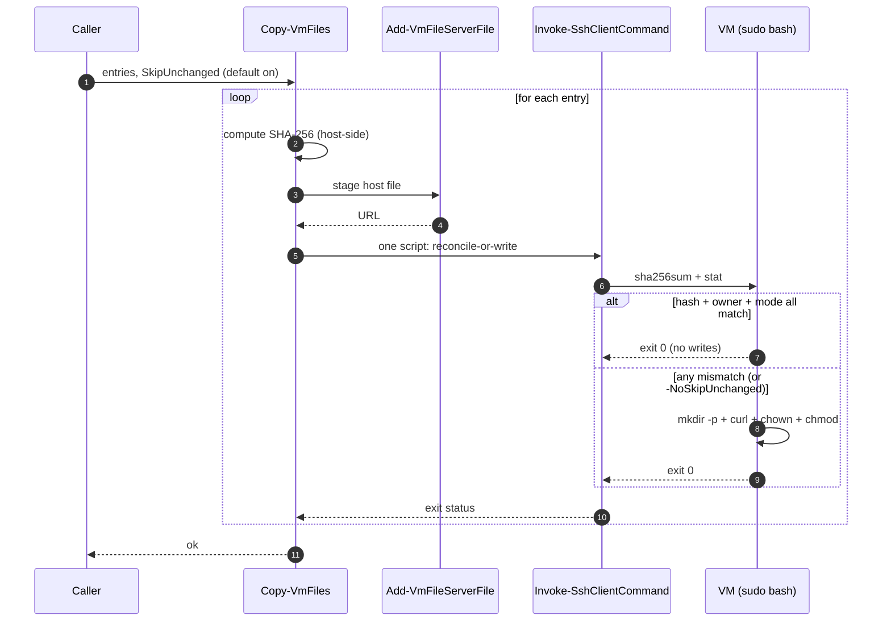
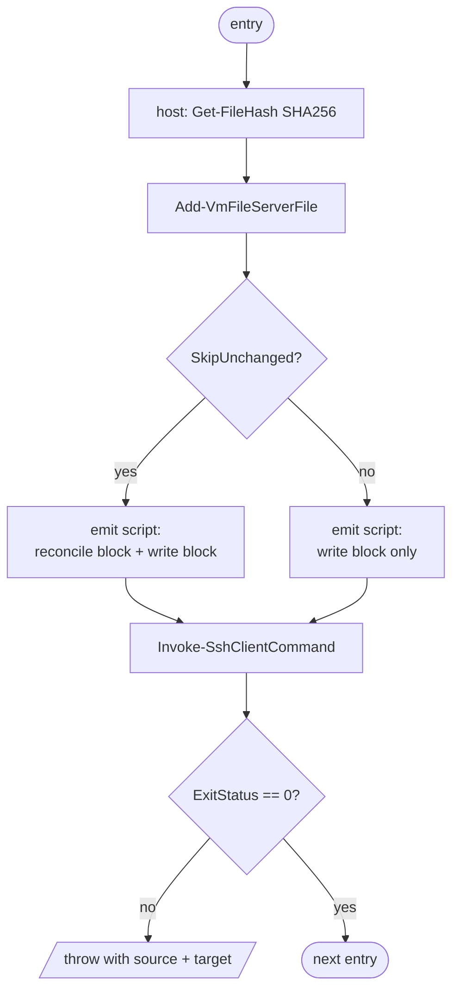
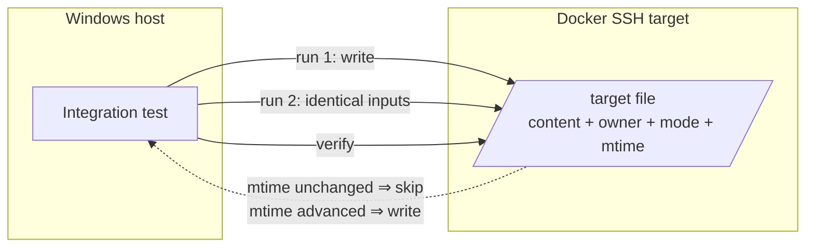
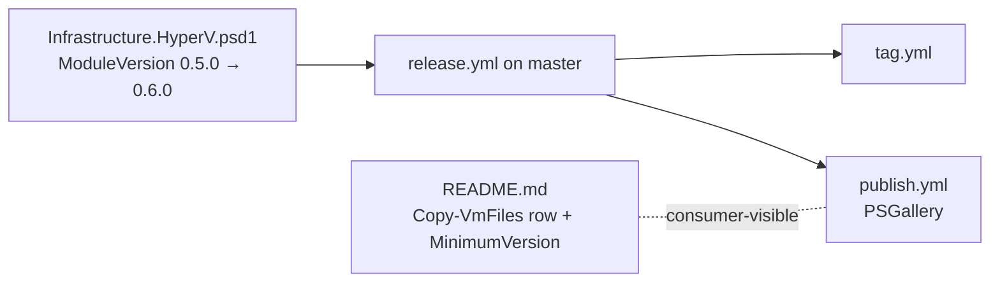

# Plan: Skip unchanged files on Copy-VmFiles

See [problem.md](problem.md) for context, scope, design decisions
and acceptance criteria. This plan turns those decisions into the
smallest committable steps that each carry their own tests.

## Index

- [Shape of the change](#shape-of-the-change)
- [Step 1: Reconcile-or-write in `Copy-VmFiles` + `-NoSkipUnchanged`](#step-1-reconcile-or-write-in-copy-vmfiles---noskipunchanged)
- [Step 2: Integration tests against the Docker target](#step-2-integration-tests-against-the-docker-target)
- [Step 3: Module version bump + README](#step-3-module-version-bump--readme)

## Shape of the change

The entire change lives inside
[Copy-VmFiles](../../../../Infrastructure.HyperV/Public/FileTransfer/Copy-VmFiles.ps1).
The bulk wrapper
[Copy-VmFilesByPattern](../../../../Infrastructure.HyperV/Public/FileTransfer/Copy-VmFilesByPattern.ps1)
inherits the new behaviour for free because it forwards entries
through the same primitive - no signature change, no test change of
its own. Staging via
[Add-VmFileServerFile](../../../../Infrastructure.HyperV/Public/FileServer/Add-VmFileServerFile.ps1)
is untouched: it is already idempotent on name + byte count and is
not on the slow path.

## Step 1: Reconcile-or-write in `Copy-VmFiles` + `-NoSkipUnchanged`

**Reason.** Lands the whole transport-side behaviour change in one
commit so the unit-test surface and the production code move together.
The remote script is small enough that splitting "compute hash" and
"emit reconcile block" into separate commits would produce an
intermediate state where the host computes a hash it does not use - a
strictly worse shape to bisect through than the merged change.

**Files.**

- Edit: `Infrastructure.HyperV/Public/FileTransfer/Copy-VmFiles.ps1`
- Edit: `Tests/Copy-VmFiles.Tests.ps1`

**Behaviour.**

- New `[switch] $NoSkipUnchanged` parameter on `Copy-VmFiles`.
  Default off means skip-unchanged is on - per
  [problem.md design decisions](problem.md#design-decisions).
- Per entry, the function:
  1. Computes the source SHA-256 host-side via
     [Get-FileHash](https://learn.microsoft.com/powershell/module/microsoft.powershell.utility/get-filehash)
     (one call, cheap relative to a single SSH round-trip).
  2. Builds one remote script. When skip-unchanged is on, the script
     starts with a reconcile block: read the target's `sha256sum` and
     `stat -c '%U:%G %a'`, compare against the desired hash + owner +
     mode, `exit 0` on match. Otherwise the existing
     `mkdir -p` + `curl -fsSL -o` + `chown` + `chmod` sequence runs.
     With `-NoSkipUnchanged`, the reconcile block is omitted and the
     script is byte-for-byte the current always-write shape.
- The reconcile block tolerates a missing target: `sha256sum` against
  a missing path produces an empty captured hash, which trivially
  fails the equality check and falls through to the full write path
  (covers the first-run case in
  [problem.md acceptance criteria](problem.md#acceptance-criteria)).
- The existing CRLF -> LF normalisation, the existing per-entry
  `ExitStatus` check, and the existing error-throw shape are
  unchanged - those rules apply to the reconcile path too.

**Tests (unit).** Mock `Invoke-SshClientCommand` and capture the
`-Command` argument; existing tests use this pattern. No live SSH.

- Default path: emitted script contains the reconcile block
  (`sha256sum`, `stat -c '%U:%G %a'`, an early `exit 0`) ahead of the
  `curl` line, and embeds the host-computed SHA literal.
- `-NoSkipUnchanged`: emitted script does NOT contain the reconcile
  block and is byte-for-byte identical to the pre-change shape.
  Pinned with a string-equality check against an inline expected
  template so accidental drift in the always-write branch fails
  loudly.
- Per-entry SHA: when two entries point at different sources, the
  emitted scripts embed two different SHA literals (no caching bug
  across entries in the loop).
- Error propagation: when `Invoke-SshClientCommand` returns
  `ExitStatus != 0`, `Copy-VmFiles` still throws with both source +
  target named, regardless of which branch the switch selects.
- Host-side hash is computed via `Get-FileHash`; the existing tests'
  fake source files (already created on disk for the staging mock)
  satisfy this with no extra fixture.

**README.** No README change in this step. The doc edit is bundled
with the version bump in Step 3 so a single commit carries both the
consumer-visible default change and the version that ships it.

## Step 2: Integration tests against the Docker target

**Reason.** Unit tests pin the script shape; only an end-to-end run
can prove that the reconcile block actually short-circuits a re-run
and that the drift cases re-apply the right dimension. Mirrors the
split the bulk-transfer feature used in
[01 - bulk-vm-file-transfer Step 3](../01%20-%20bulk-vm-file-transfer/plan.md#step-3-integration-tests-against-the-docker-target).

**Files.**

- New: `Tests/Integration.DockerTarget/Copy-VmFiles.SkipUnchanged.Tests.ps1`

**Scenarios (each a separate `It` against the live container).** All
verification uses the existing
[Invoke-SshClientCommand](../../../../Infrastructure.HyperV/Public/Ssh/Invoke-SshClientCommand.ps1)
helper. mtime is the proxy for "did the VM-side write run" - a skip
must leave mtime unchanged; a write must advance it.

1. First run lands the file with the requested content, owner and
   mode. Establishes the baseline.
2. Second identical run leaves the target's mtime unchanged. Proves
   the reconcile block short-circuited.
3. Second run with a mutated host source advances mtime AND updates
   contents to the new bytes. Proves a content diff re-writes.
4. Second run with the host source unchanged but the VM-side owner
   manually chowned away re-applies the requested owner. mtime
   advances. Proves owner drift triggers re-write.
5. Second run with the host source unchanged but the VM-side mode
   manually chmoded away re-applies the requested mode. mtime
   advances. Proves mode drift triggers re-write.
6. `-NoSkipUnchanged` on an identical re-run advances mtime even
   though nothing changed. Proves the opt-out actually opts out.

**Tests (unit).** None - this step adds only integration tests.

**Mermaid.**

**README.** No change. The Docker-target runner already documents the
new file's location via convention; no new top-level test category.

## Step 3: Module version bump + README

**Reason.** Ships the change to consumers. Bundled into its own commit
so the release-triggering psd1 edit is unambiguous on the
[release workflow](../../../../.github/workflows/release.yml) and so
the README mention of the new default lands in lockstep with the
version that actually carries it.

**Files.**

- Edit: `Infrastructure.HyperV/Infrastructure.HyperV.psd1`
  (`ModuleVersion` bump - additive change to a public function, so a
  minor bump from 0.5.0 to 0.6.0).
- Edit: `README.md`:
  - Update the `Copy-VmFiles` row in the functions table to mention
    that re-runs reconcile against the VM (hash + owner + mode) and
    skip when all three match, with `-NoSkipUnchanged` as the
    explicit opt-out.
  - Bump the `Install-Module -MinimumVersion` line to 0.6.0.
- Add: `Copy-VmFilesByPattern` row no-op note via the existing
  "inherits the transport contract" wording - no new row, no edit
  needed if the wording is already implication-clean. Verified at
  edit time against the current README state.

**Tests.** None. Documentation + manifest edits are validated by the
shared `Module.Tests.ps1` parity check in the run-unit-tests action,
which fails if `FunctionsToExport` and `Export-ModuleMember` diverge
- not affected here since no public function is added or removed.

**Mermaid.**

**README.** This step IS the README change.
